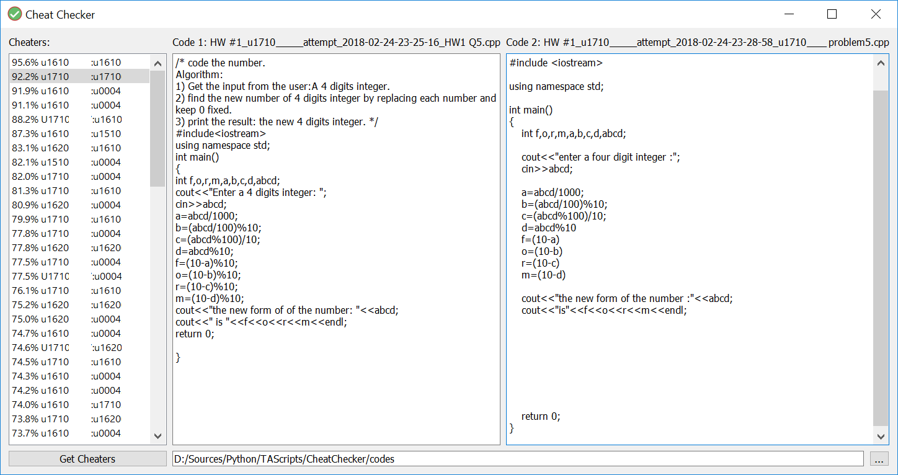

## Cheat Checker

A simple application that checks code submissions for possible cheating attempts among the submitted codes.  
It's written using PyQt5 in Python 3 and is licenced under the MIT license.

### Demo


### Setup

1. Install all packages required for this application using this command:
    ```bash
    pip install -r requirements.txt
    ```

2. After applying changes to the application layout (using QT Designer), run this command:
    ```bash
    pyuic5 checker.ui -o layout.py
    ```

### Deployment
- To run the application directly through Python, simply use this command:
    ```bash
    python main.py
    ```

- To convert the application into an "exe" executable, use this command (find .exe in dist/ folder): 
    ```bash
    pyinstaller --clean -F -w main.py -i checker.ico --add-data="checker.ico;." -n cheatchecker
    ```

### References
- [Python](https://www.python.org)
- [PyQt](https://riverbankcomputing.com/software/pyqt/intro)
- [MIT License](./LICENSE.md)