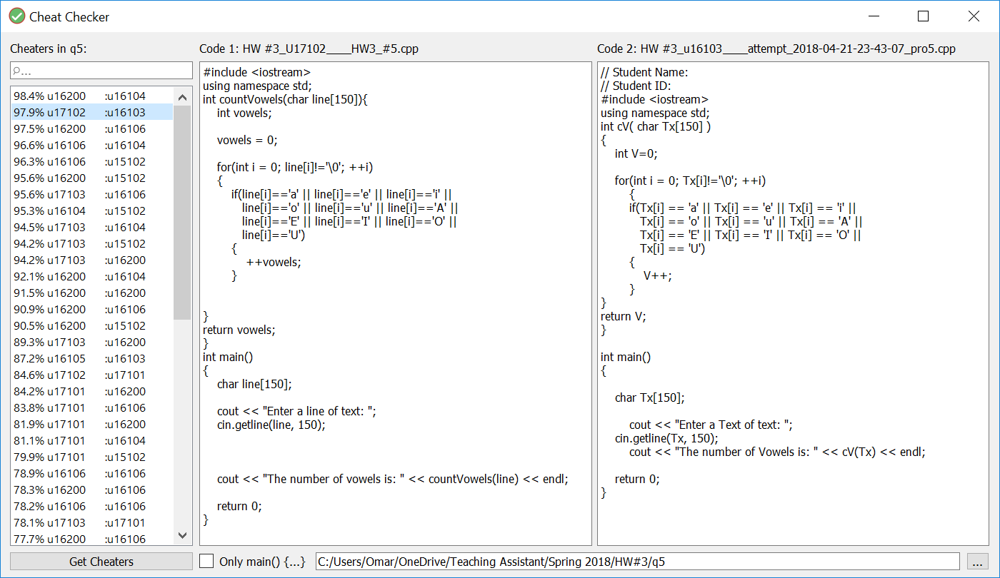

## Cheat Checker

A simple program that checks code submissions for possible cheating attempts among the submitted codes.  
It's written in Python 3 using PyQt5 and is licensed under the [MIT license](./LICENSE.md).

### ScreenShot


### How It Works

The user specifies the folder where all the code files are located.  
The program then runs through them and cleans the code from the following:

- Code outside the main function
- Spaces and new lines
- Variable names

Then it compares all cleaned code strings against each other,  
and lists them starting from the most similar ones.

### Downloads

Download the latest compiled "exe" file from [Releases](../../releases).  
Or download the source code and follow the steps below to run it.

### Setup

1. Install all packages required for this application using this command:
    ```bash
    pip install -r requirements.txt
    ```

2. After applying changes to the application layout (using QT Designer), run this command:
    ```bash
    pyuic5 checker.ui -o layout.py
    ```

### Deployment
- To run the application directly through Python, simply use this command:
    ```bash
    python main.py
    ```

- To convert the application into an "exe" executable, use this command (find .exe in dist/ folder): 
    ```bash
    pyinstaller --clean -F -w main.py -i checker.ico --add-data="checker.ico;." -n cheatchecker
    ```

### References
- [Python](https://www.python.org)
- [PyQt](https://riverbankcomputing.com/software/pyqt/intro)
- [MIT License](./LICENSE.md)